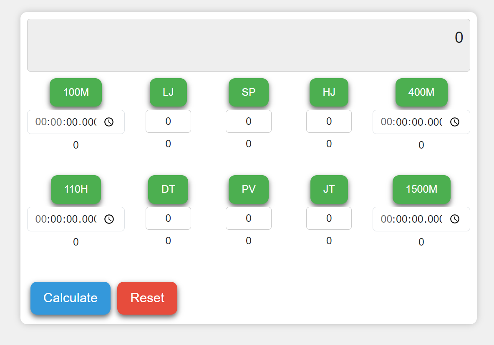

Decathlon calculator
===

## Decathlon Scoring Calculator.
This project is a calculator designed to calculate the scores for the Decathlon sports event. 
It takes input data for various athletic disciplines, such as running, jumping, and throwing, 
and calculates the total score based on the performance in these disciplines. 
The Decathlon Scoring Calculator is a useful tool for athletes and coaches 
to determine the overall performance in a Decathlon competition.

## Requirements:
- Java
- Maven
- Vue.js
- Spring Boot

## Commands for building the project:
- `mvn compile`: Compile the project.
- `mvn package`: Package the project.
- `mvn install`: Add the project JAR file to the local repository.

## Run project without using IDE:
- `mvn spring-boot:run`: Run the project using Maven.

## The application is running on localhost
###### http://localhost:8080/

## Authors
###### Jelena Freiberg https://github.com/JelenaFr